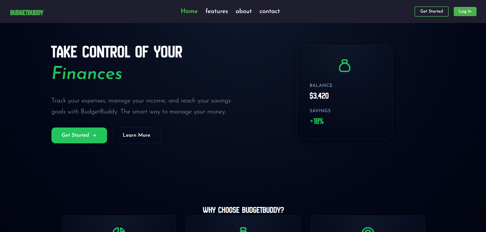

# BudgetBuddy 💰

**BudgetBuddy** is a personal finance management web application built with **React + Vite + Firebase**.  
It helps users track income, expenses, and notes, visualize data on a dashboard, and manage their profile securely.  



---

## 🚀 Features

- 🔐 **Firebase Authentication**
  - Email/password
  - Google OAuth
  - GitHub OAuth
- 💸 **Transactions**
  - CRUD operations for income & expenses
- 📝 **Notes**
  - Add, edit, delete, and search notes
- 📊 **Dashboard**
  - Charts and statistics for quick insights
- 👤 **User Profile**
  - Manage your profile securely
- ⚙️ **Backend API**
  - Node.js + Express
- 🔒 **Security**
  - Environment variables hide sensitive info
  - Only authenticated users can access their data
- 📱 **Responsive UI**

---

## 📂 Project Structure

```text
BudgetBuddy-Web/
├── backend/                  # Backend API (Node.js/Express)
│   ├── config/               # Firebase Admin setup
│   ├── middleware/           # Authentication middleware
│   ├── routes/               # API routes: transactions, notes, users, dashboard
│   ├── .env                  # Sensitive keys (ignored by git)
│   ├── server.js             # Main backend server
│   └── package.json
└── src/                      # Frontend (React/Vite)
    ├── pages/                # Pages: Income, Expenses, Notes, Dashboard, Profile
    ├── services/             # API and Firebase services
    └── assets/               # Images (e.g., HomePage.png)
```

## ⚙️ Setup

### 1. Clone the repo
```bash
git clone https://github.com/HamidMbairik/BudgetBuddy-Web.git
cd BudgetBuddy-Web
```

### 2. Install dependencies
#### backend
```bash
cd backend
npm install
```
#### frontend
```bash
cd ../
npm install
```

### 3. Configure environment variables

- Create *.env* files for frontend and backend (ignored in Git) and add *your Firebase credentials*.
- Use *.env.example* as a template (without real keys).

## 💻 Run the project

### backend
```bash
cd backend
npm run dev
```
- *API runs at: http://localhost:3001/api*
### frontend
```bash
npm run dev
```
- *Frontend runs at: http://localhost:5173*

## 🔐 Security

- Firebase Admin SDK is used for backend operations

- Environment variables hide sensitive info

- Only authenticated users can access their own data

- Backend validates all requests and IDs

## 📦 Tech Stack

- Frontend: React, Vite, Tailwind CSS (optional)

- Backend: Node.js, Express

- Database: Firebase Firestore

- Authentication: Firebase Auth

- Deployment: Vercel (frontend), Railway/Heroku (backend)

## 📖 Usage

1.  Sign up or log in using Firebase Authentication.

2. Add income and expenses in the respective pages.

3. View notes or add new ones.

4. Check dashboard for summaries and charts.

5. Update your profile in the Profile page.

## 📜 License

MIT License © Hamid Mbairik | L3zwaDev
